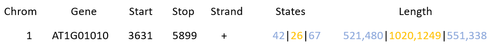

# Chromatin state analysis

This package contains the following scripts : 
- search_states.py
- state_coverage.sh

and the `chrom_states_file` : 
- chrom_states_At_Sequeira-Mendes

## Search_states.py

Search_states.py allows to attribute to each gene of *Arabidopsis thaliana*, the corresponding chromatin states. It is based on the work of Sequeira-Mendes *et al*. : [The Functional Topography of the Arabidopsis Genome Is Organized in a Reduced Number of Linear Motifs of Chromatin States](https://www.ncbi.nlm.nih.gov/pubmed/?term=The+Functional+Topography+of+the+Arabidopsis+Genome+Is+Organized+in+a+Reduced+Number+of+Linear+Motifs+of+Chromatin+States ""). The Plant Cell, 26(6), 2351–2366.

### What can search_states.py do ?

- Determine the chromatin state(s) for each gene and print it as a string of states taking into account the direction of the gene. Consequently, reading always goes from left to right.
- Determine the chromatin state(s) for the intergene space, when it exsit, up and downstream of the gene and print it as a string of states taking into account the direction of the gene. The intergene space display is limited to 1 kb for convenient reading.
Gene chromatin states are separated from intergen chromatin states with pipes.
- Compute the length, in bases, of each states in both gene and intergene space and print them as a coma speparated list

Result will look like :

Columns States and Length are made of 3 fields separated with pipes. 

#### States column

The states column has to be read like this :

string of chromatin states for the intergen space (here 4 and 2, in blue) `|` string of chromatin states for the gene body (here 2 and 6, in orange) `|` 
string of chromatin states for the intergen space (here 6 and 7, in blue)

#### Length column

In the length column are the lenght in bases for each state. Lengths are coma separated. In the above exemple we have :

Intergen space : 521 bases for state 4, 480 bases for state 3 `|` Gene body : 1020 bases for state 2, 1249 bases for state 6 `|` Intergen space : 551 bases for state 6, 338 bases for state 7

### How to use search_states.py ?

    search_states.py chrom_states_file data_file

With :
- chrom_states_file

The file contening the topography of all chromatin states for Arabidopsis whole genome as determined by Sequeira-Mendes *et al*.

This file must contain : chromosome name, interval coordinate and state.

        Chrom	From	To	    State
        1	       1	1200	8
        1	    1201	3150	4
        1	    3151	4650	2
        1	    4651	6450	6
        ...
        
This file is provided under the name : `chrom_states_At_Sequeira-Mendes`
        
- data_file

The file containing the gene or interval for which you want to determine the chromatin states. 

This file must contain : chromosome name, gene name, start, stop, strand and must be sorted on chromosom and Start column.

        1       AT1G01010       3631    5899    +
        1       AT1G01020       6788    9130    -
        1       AT1G03987       11101   11372   +
        1       AT1G01030       11649   13714   -
        1       AT1G01040       23121   31227   +
        1       AT1G03993       23312   24099   -
        ...

Surch file can be generated from an annotation file in GTF format with the following command lines.

Exemple : 

- Using TAIR10.38
        
        awk -v OFS='\t' '! /^(#|Mt|Pt)/ && $3 == "gene" && $10 ~ /^"AT/ {print $1,$10,$4,$5,$7}' Arabidopsis_thaliana.TAIR10.38.gtf | sort -k1,1n -k3,3n  | sed 's/"//g; s/;//' > TAIR10.38_chrom_state
        
- Using Araport11

        awk '$12 ~ /AT[1-5]/ {print $12, $4, $5, $7}' Araport11_genes.20151202.gtf | sed 's/^chr//; s/"//g; s/;//' | 
        awk -v OFS='\t' '{  
          strand[$1]= $4;   
          if (start[$1] == 0 || $2 < start[$1]) start[$1]= $2;  
          if ($3 > stop[$1]) stop[$1]= $3   
        }  
        END {  
            for (gene in strand) {  
                     print substr(gene, 3, 1), gene, start[gene], stop[gene], strand[gene]  
            }  
        }' | sort -k1,1n -k3,3n > Araport_chrom_state
   

## state_coverage.sh

state_coverage.sh computes the number of bases covered by each state **of the gene body** in a search_state.py output file.

### How to use state_coverage.sh

    state_coverage.sh search_state.py_output_file
    
or

    search_state.py | state_coverage.sh
    
Result will look like :

    state 1 : 12679709
    state 2 : 7391911
    state 3 : 12111790
    state 4 : 4055970
    state 5 : 9201393
    state 6 : 9341429
    state 7 : 11915907
    state 8 : 2621600
    state 9 : 8778898

## About Chromatin state analysis
These tools have been developped at [LGBP - BIAM](http://biam.cea.fr/drf/biam/Pages/laboratoires/lgbp.aspx) by M. Terese and C. Lecampion.
